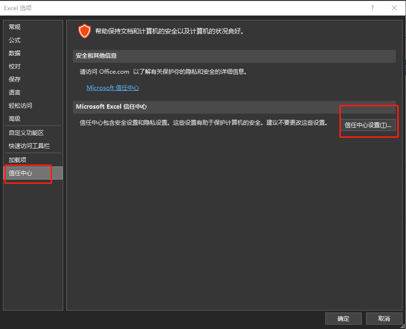
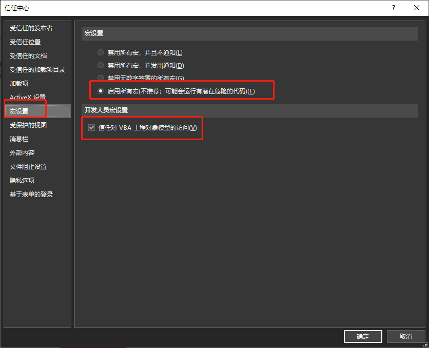

# excel-001：响应单元格操作在指定单元格自动生成时间戳

VB代码如下：
```vb
REM:VB代码 
Private Sub Workbook_SheetChange(ByVal Sh As Object, ByVal Target As Range)   
If ActiveSheet.Name <> "Sheet1" Then Exit Sub     
With Target       
REM:如果第7列内容不为空，且行数大于3且小于1000，则在目标格后两格内填充时间戳       
If .Column = 7 And .Row > 3 And .Row < 1000 Then .Offset(0, 2) = Now       
End With     
End Sub
```
完成后保存出现不能保存未启动宏的吧啦吧啦问题，解决方案：
1. 在选项-信任中心-信任中心设置-宏设置，启用宏
   


2. 保存文件为“EXCEL启用宏的工作簿”   



3. 搞定
